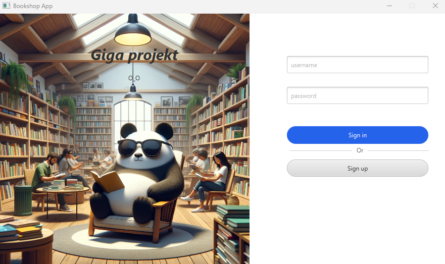
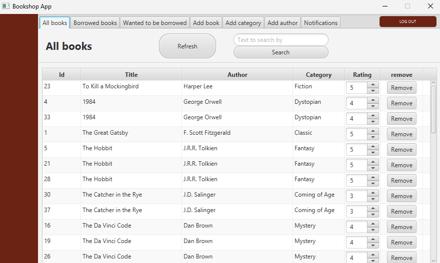
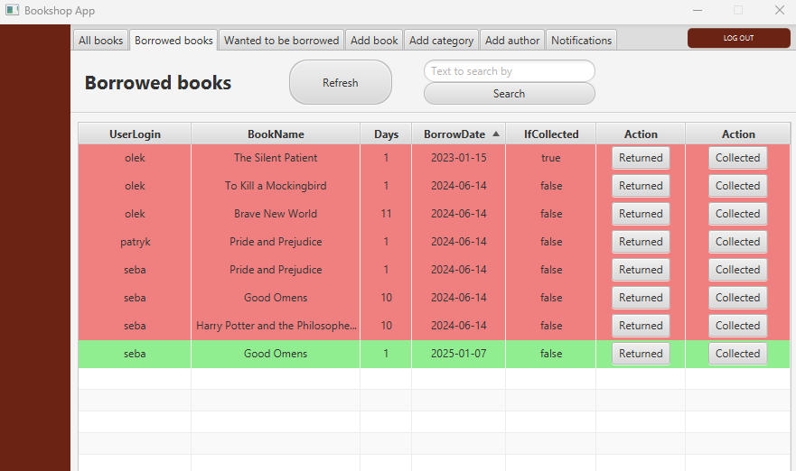
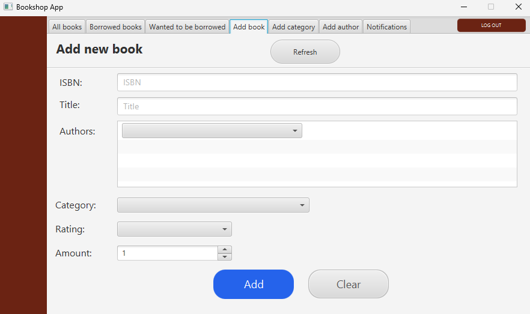
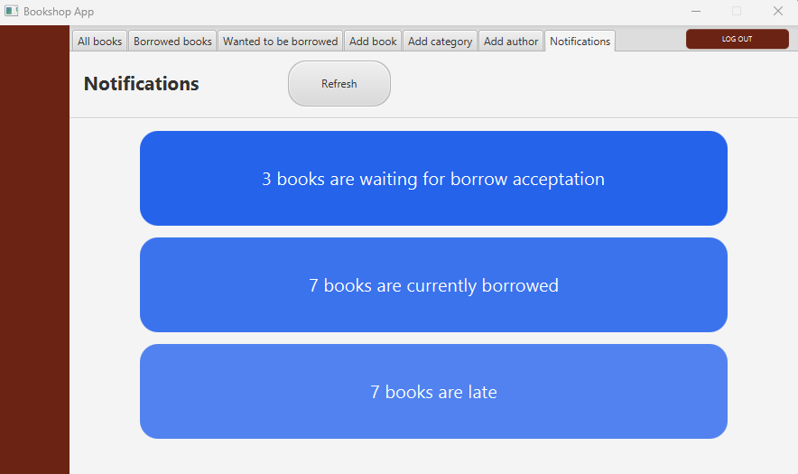
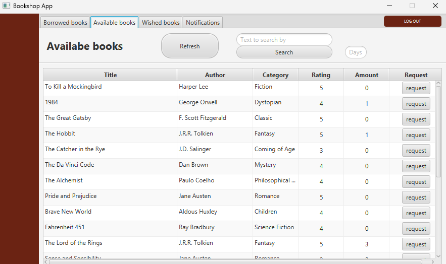
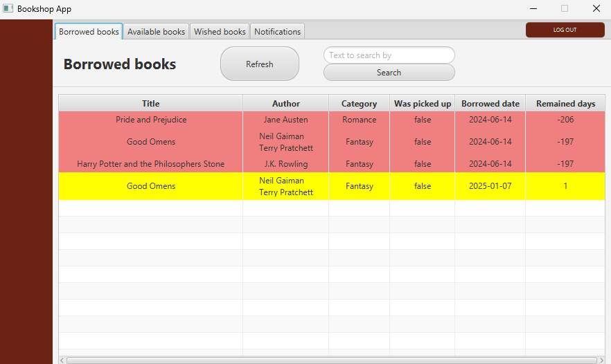
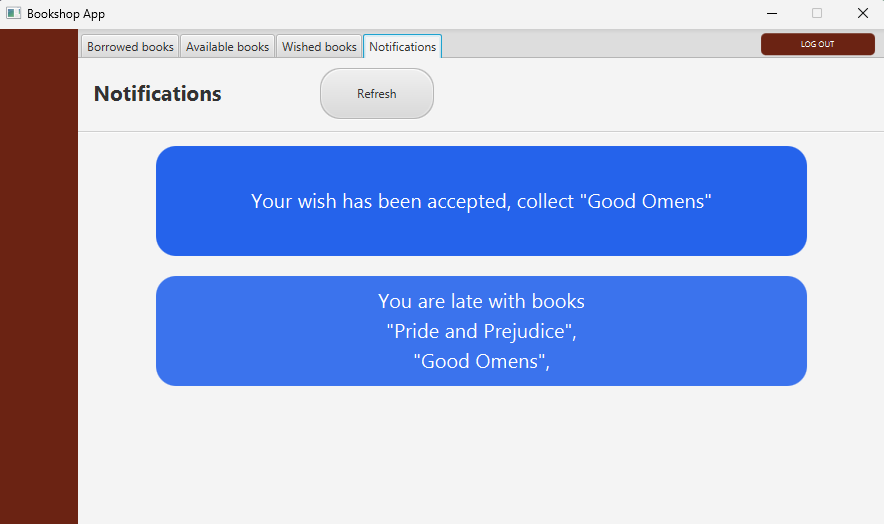
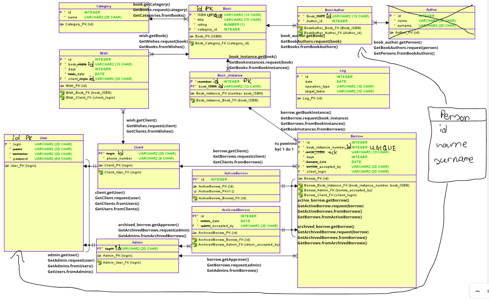

## Aplikacja do obsługi biblioteki

### Logowanie do aplikacji

Przykładowe konta do poziomu admina:

- login: franek, password: 123
- login: boguś, password: 123

Przykładowe konta do pozimu usera:

- login: seba, password: 123
- login: olek, password: 123
- login: patryk, password: 123

Można też samemu się zarejestrować jako nowy użytkownik

---

### Widok startowy

---

### Przykładowe widoki z poziomu admina

  

  

  

---

### Przykładowe widoki z poziomu usera

  

  

---

### Logiczny schemat bazy danych i przykładowe sposoby dostępu z poziomu kodu aplikacji

